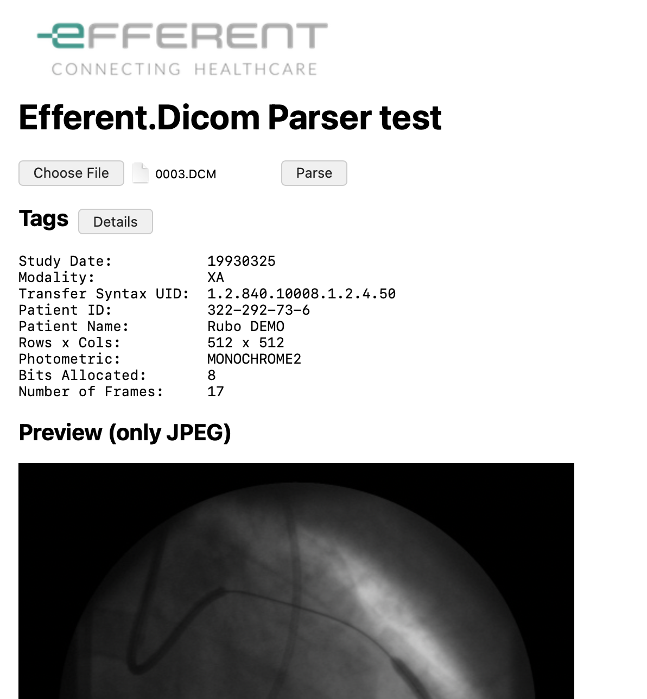

# Efferent.Dicom
[](https://www.npmjs.com/package/efferent-dicom)
[](https://www.npmjs.com/package/efferent-dicom)
[](https://github.com/Efferent-Health/dicom)

Javascript library for reading and writing DICOM files in desktop, cloud and browser applications.
The following frameworks are supported:
- Browser (Javascript)
- NodeJS ESM
- NodeJS CJS

## API Overview

### Main classes
- DicomReader - DICOM reader and parser, with image extraction capabilities
- DicomWriter - DICOM creator and serializer

### Ancillary
- DicomElement - Main building block for DICOM files
- DICOM_TAG - Collection constants for commonly used DICOM tags
- DicomDictionary - Contains VR and description for most used DICOM tags
- PixelSpacing - Used for calibration purposes

## Usage

### Browser applications
Add a reference to the script into your html header section:
````html
<head>
    <script src="Efferent.Dicom.js"></script>      <!-- Full     -->
    <script src="Efferent.Dicom.min.js"></script>  <!-- Minified -->
</head>
````
If preferred, you can use a CDN url like:
````html
<head>
    <script src="https://cdn.jsdelivr.net/npm/efferent-dicom@1/dist/Efferent.Dicom.js"></script>      <!-- Full     -->
    <script src="https://cdn.jsdelivr.net/npm/efferent-dicom@1/dist/Efferent.Dicom.min.js"></script>  <!-- Minified -->
</head>
````

You can also import the library using bundlers such as Webpack, Rollup, or Vite.

### NodeJS
The library is published on npm as `efferent-dicom`.

**ESM (ECMAScript Modules)**  
If your project uses `"type": "module"` in `package.json` or has `.mjs` files:
```js
import { DicomReader, DICOM_TAG as TAG } from 'efferent-dicom';
```

**CommonJS (require syntax)**  
If your project uses the default CommonJS module system:
```js
const { DicomReader, DICOM_TAG: TAG } = require('efferent-dicom');
```

#### Note  
- In CJS, destructuring syntax uses `DICOM_TAG: TAG` to rename the constant.  
- In ESM, you can directly alias using `as TAG`.

#### Example
```js
import fs from 'fs';
import { DicomReader, DICOM_TAG as TAG } from 'efferent-dicom';

const data = fs.readFileSync('example.dcm');
const parser = new DicomReader(new Uint8Array(data.buffer));
console.log(parser.DicomTags[TAG.PATIENT_NAME]);
```

### Typescript declaration file (d.ts)

If working with typescript, install `efferent-dicom` npm module in your package.json.
This way, TypeScript automatically finds the right .d.ts whether the developer is using:
- Node: `import { something } from "efferent-dicom";`
- Browser build: `import "efferent-dicom/browser";`

If not using npm packages, include Efferent.Dicom.d.ts in your tsconfig.json file:
````json
    "include": [
        "./lib/Efferent.Dicom.d.ts",
        // Other files
    ]
````

## Demos

There are two demo applications, included in this repository:

### NodeJS
Run node/dicomdump.js to print in the console detailed DICOM tags, using the command:
````sh
node ./demo/node/dicomdump.js <dicom file>
````

### Browser
Open demo/html/index.html for an interactive demo that can read a DICOM file (.dcm extension), show a summary and a picture (only for .50 JPEG transfer syntax), as well as detailed DICOM tags

